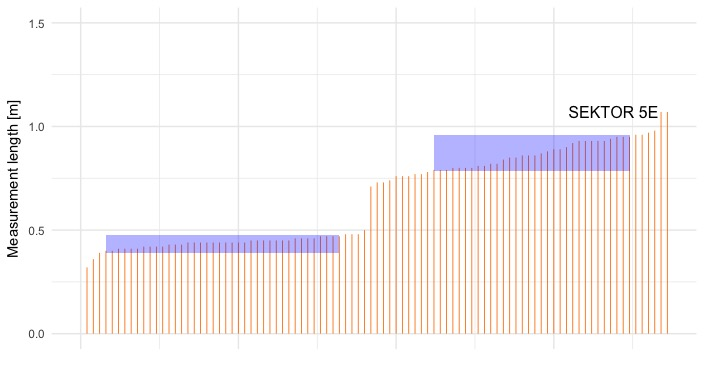

Toolbox for archeological quantitative analysis
================
maciejkasinski
14 October 2017

Description
-----------

<left></left>

A set of tools for exploring an archeological challenge of finding a quantum in urban site. Quantum is defined as a common measurement unit specific for given culture and time (like foot or elbow).

Project description
-------------------

The repo is a part of PhD project on metrological analysis of Machu Picchu urban complex.

Setup
-----

Initialize project

``` r
source("_init_project.R")
```

Graphical examples
------------------

Toolbox of mathematical methods is supported by graphical representation of their results.

#### Size distribution against quantum

<left></left>

#### Boostrap confidence interval

<left></left>

#### Selective least squares method

<left></left>
